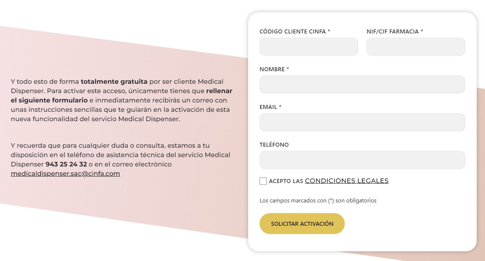
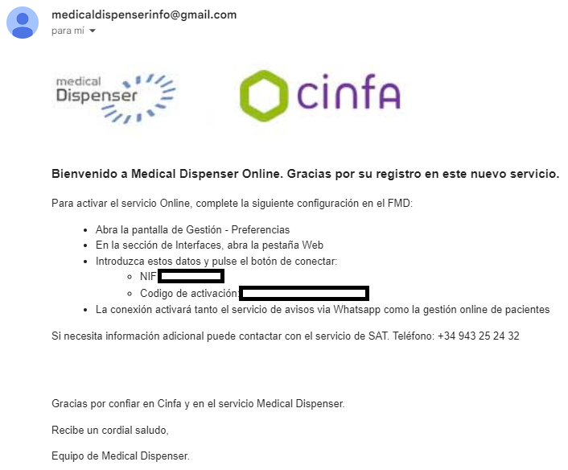
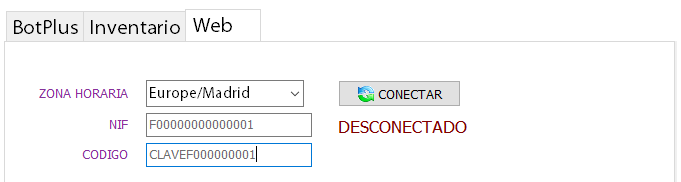

# Activación del servicio {{ site.client }}

## Solicitud de código de activación

1. Debemos pulsar en el botón "Web" de la parte superior derecha de la pantalla.
	

	

1. En el formulario que se abre, rellenamos los datos y lo enviamos.
	*El NIF/CIF debe ser el que figura en la actividad de la farmacia.*

	

1. Se recibirá un email en la dirección indicada, con las instrucciones de activación.

	

## Conexión de la farmacia al sistema online

Para conectarse al servicio online, hay que seguir los siguientes pasos:

1. Ir al menú: `Gestión > Preferencias > Web`

1. Indicar el NIF de la farmacia a la que se le ha autorizado el uso del servicio, y el código que se le ha proporcionado en el email.

1. Pulsar el botón CONECTAR

	

_Si la operación es correcta, el FMD ya está conectado al sistema online. A partir de ahora, debemos decidir qué categorías de pacientes deberán sincronizarse_.
