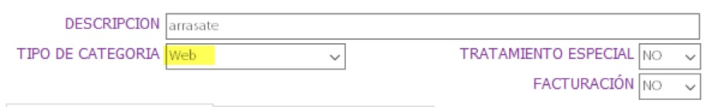

# Sincronización de categoría

El paso de los pacientes de FMD al sistema online se realiza mediante las categorías.
Una vez sincronizada una Categoría, _los tratamientos de sus pacientes pasarán a estar online_.

## Pasos para sincronizar

Para poder sincronizar una categoría hay que seguir los siguientes pasos:

1. Pulsar en `Categorías` y seleccionar la categoría deseada.

1. Establecer el tipo de categoría a "Web"

	

Los pacientes de esas categorías y sus tratamientos se sincronizarán con el sistema online.

_Se puede repetir este proceso con todas las categorías que sean necesarias. Distintos grupos de pacientes, distintas residencias, ..._

