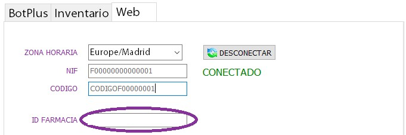

# Acceso a la web

Una vez se haya conectado la categoría a la web, podemos acceder a dicha categoría desde la página web con cualquier usuario de FMD que tenga rol de farmacéutico, o el usuario por defecto de la categoría.

Se puede acceder a la web pulsando el botón "Web" que aparece en la parte superior derecha de la pantalla.

## Inicio sesión

Como se ha indicado, se puede iniciar sesión con el perfil de farmacia o perfil de residencia (o de categoría). El usuario con perfil de residencia debe introducir el mismo nombre de usuario y contraseña que utiliza en el software FMD. Mientras que el perfil de residencia debe introducir como nombre de usuario y contraseña el mismo nombre de la categoría, en este caso "Categoria Prueba".

Ambos tienen en común que hay que introducir un ID de farmacia, el cual lo encontramos en la pantalla donde anteriormente hemos conectado el FMD a la web.

### Primer inicio de sesión

1. La primera vez que cada usuario inicia sesión, se pide que se firmen los documentos correspondientes.

	

1. Después, se pide restablecer la contraseña inicial, ya que la contraseña del usuario de residencia es la misma que el nombre de la categoría, y la contraseña del usuario de farmacia puede que no cumpla con los requisitos mínimos de seguridad de una contraseña. Para ello se pide rellanar estos datos.

	

1. Se envía un correo con el enlace para restablecer la contraseña a la dirección de correo que se ha especificado anteriormente.

	

1. Iniciamos sesión con la nueva contraseña y vemos la página principal

	

## Tipos de usuarios

Como se ha mencionado anteriormente, hay dos tipos de usuarios, el usuario de farmacia y el usuario de residencia. Ambos tipos acceden a la misma página web con la misma interfaz, pero tienen roles diferentes como se explica a continuación.

### Usuario con perfil de farmacéutico

El usuario con perfil de farmacia accede a la página web con el mismo usuario y contraseña que en el software FMD. Estas con las características de este usuario:

1. Puede seleccionar entre las diferentes categorías que ha sincronizado la farmacia, y ver todos los pacientes y tratamientos que pertenecen a esas categorías.

	

1. Los cambios que realiza tanto de un paciente como de un tratamiento, se sincronizan al software FMD sin tener que ser validados en el FMD.

1. Como los cambios realizados en el tratamiento entran directamente en el FMD, es obligatorio seleccionar la presentación exacta de un medicamento cuando se vaya a añadir al tratamiento

### Usuario con perfil de residencia

El usuario con perfil de residencia accede a la página web con el nombre de la categoría como nombre de usuario y contraseña, hasta que restablece la contraseña. Estas son sus características:

1. Solo puede acceder a su propia categoría, es decir, no tiene permiso de acceder a las demás categorías de la farmacia.

1. Los cambios que realiza en los pacientes y los tratamientos quedan pendientes de validar, hasta que se aprueban en el software FMD. Es decir, cuando se hace un cambio, este queda como propuesto, y desde el FMD se puede validar o rechazar el cambio.

1. Al añadir un medicamento nuevo al tratamiento, se puede seleccionar la presentación exacta del medicamento, o sino el grupo homogéneo. Desde la farmacia, cuando se vaya a validar ese cambio, se escoge una presentación de ese grupo homogéneo en base a su criterio.

