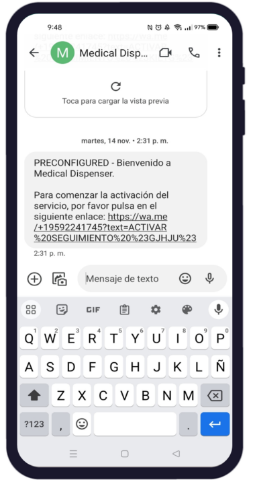

# Activación avisos

Mediante el programa FMD se realiza toda la programación y configuración relacionada con el sistema
de avisos. Para la programación de este, se han de seguir los siguientes pasos.

## Ficha paciente

En la ventana de ficha de paciente, se diferencian dos ventanas principales, por un lado, se
puede observar la ficha del paciente con todos sus datos personales, de contacto, datos clínicos, el
responsable médico y documentación. Por otro lado, en la ventana de configuración se define el tipo
de servicio para la toma de medicación: Blíster.

Al pulsar sobre ACTIVAR AVISOS, aparece la ventana AVISOS que es donde se configuran los
parámetros, hora toma medicación, tiempo de alarma y el número de teléfono del paciente y del
cuidador.

 

### Configurar paciente o cuidador

Introducir uno por uno el número de teléfono del paciente y del cuidador con el prefijo del país al
que corresponda y pulsar sobre “INVITAR”. Automáticamente se abrirá la siguiente ventana, donde
tendrá que indicar a quien está asociado en número de teléfono que aparece en pantalla (paciente o
cuidador).

Al pulsar “Configurar” aparecerá el siguiente aviso confirmando que la configuración se ha realizado
correctamente. Pulsar ACEPTAR.

 

La persona invitada al servicio aparecerá inactiva hasta que activen los avisos desde el teléfono
móvil.

 

### Activar avisos

Una vez realizado toda programación y configuración previa al servicio, el paciente/cuidador recibirá
un SMS, como el que se muestra en la figura inferior. Deberá pulsar en el enlace y seguir las siguientes
instrucciones:

 

Al acceder al enlace se abrirá automáticamente la aplicación WhatsApp. Después, hay que mandar el
mensaje de activación del seguimiento que aparece en la barra inferior del chat. Recibirá un mensaje
como el que se muestra en la figura inferior donde se le indicara que los avisos han sido activados.

 

La integración y activación del cuidador en el servicio de avisos WhatsApp, se hace siguiendo los
mismos pasos: introducir el número de teléfono del cuidador, seleccionar “cuidador en la ventana
“Configuración seguimiento” y activar avisos.

