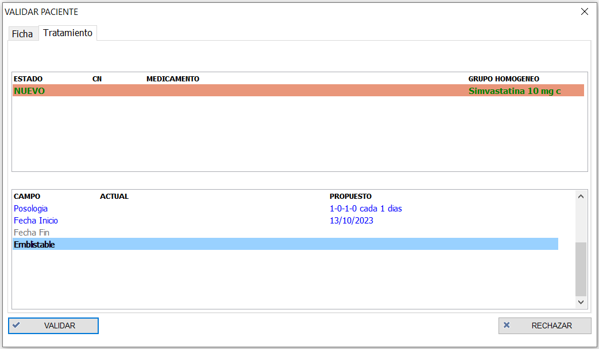

# Validación de propuestas desde FMD

Una vez hayamos realizado los cambios correspondientes en la página web, podemos ver esos cambios desde la página web. Podemos ver o darnos cuenta de que hay un cambio mediante estas vías:

1. En cuanto haya un cambio en la página web, en un periodo corto de tiempo, aparecerá un indicador en la parte superior derecha de la pantalla. Si pulsamos el indicador, se nos abre la lista de categorías que contienen cambios pendientes de validar.

	

1. La segunda opción para ver si hay cambios propuestos es abriendo la lista de categorías directamente desde FMD. En esta lista podemos ver las categorías que no están conectadas a la web en gris, las que están conectadas y no tienen cambios pendientes en azul, y las que estásn conectadas y tienen cambios pendientes en rojo.

	

1. Por último, podemos ver si hay cambios propuestos en caso de que vayamos a preparar una carga a un paciente de una categoría conectada, o vayamos a preparar cargas por categoría de una categoría conectada. Si el software deja preparar las cargas sin problemas, quiere decir que no había cambios pendientes de validar. Sin embargo, en caso de haber cambios, el software indica lo siguiente.

	

	En este caso, podemos continuar la carga sin validar los cambios (no se cargarían los nuevos cambios en el SPD), o podemos darle al botón de "Revisar" y validar los cambios antes de preparar la carga.

## Pacientes con cambios

Una vez sepamos el estado de cada categoría, podemos ir a revisar los cambios siguiente estos pasos:

1. Seleccionar la categoría que queremos revisar, y en el menú izquierdo de la categoría pulsar el botón "Revisar"

	

1. Veremos la lista de pacientes con cambios propuestos, rechazados o nuevos pacientes

	

1. Seleccionamos un paciente para ver sus cambios, y podemos ver los cambios en la ficha, los cambios en el tratamiento, y el histórico de comentarios o acciones que se han realizado sobre ese paciente.
 
## Consulta de cambios propuestos

Para poder validar los cambios de un paciente, hay que tener en cuenta que se validan todos los cambios a la vez, es decir, no se pueden validar unos cambios y dejar otros sin validar. 

### Ficha de paciente

En caso de la ficha del paciente, podemos ver en la columna de la izquierda los datos del paciente actual en el FMD (campos vacíos en caso de que sea un nuevo paciente), y los datos nuevos introducidos en la página web, se ven en la columna de la derecha. Si hay algún cambio en uno de los campos, este campo se ve en color azul. En caso de que no haya ningún cambio en la ficha, esta pestáña no se muestra.

 

### Tratamiento

Si hay algún cambio en el tratamiento, se muestra una pestaña de tratamiento, con todos los medicamentos. En la parte de arriba se muestran los medicamentos nuevos que se han introducido en la página web, los medicamentos que se han editado en la página web, y los medicamentos que se han borrado en la página web. Para ver el cambio que se ha realizado en alguno de los medicamentos, pulsamos sobre el medicamento de arriba, y en la parte inferior vemos el cambio propuesto, ya sea en la posología o en algún otro campo.

 

#### Medicamento nuevo

Los medicamentos nuevos que se han añadido desde la página web, pueden ser de tres tipos:

1. Medicamento con presentación concreta
	Si desde la página web se ha añadido una presentación concreta de un medicamento, este aparece con un fondo sin color en el FMD, y se puede validar sin problemas

1. Medicamento con presentación concreta, sin definir en el FMD
	En caso de que se trate de una presentación que no lo tenemos definido en el FMD, el medicamento aparece con el fondo de color amarillo. En ese caso, tenemos que hacer doble click en el medicamento, y definir las propiedades del medicamento.

1. Grupo homogéneo
	En caso de que desde la página web se haya especificado un grupo homogéneo y no una presentación, vemos que el código nacional y la descripción del medicamento están vacías, y el color de fondo es naranja. Tenemos que hacer doble click, y especificar la presentación exacta de ese grupo homogéneo.

	 
	 

### Comentarios

En la última pestaña de comentarios podemos ver el historial de comentarios y cambios que se han realizado sobre ese paciente, los nombres de los usuarios que lo han realizado, y la fecha en la que se ha realizado.

 

## Validar/rechazar los cambios

Una vez hayamos definido los nuevos medicamentos, en caso de haberlos, podemos validar o rechazar los cambios. Si se validan los cambios, estos se modifican en el software FMD, y se podrían ver en las pantallas de ficha o tratamiento del paciente. En caso de querer rechazar los cambios, se pulsa el botón "Rechazar", y escribimos el comentario con el que queremos enviar el rechazo.

 

